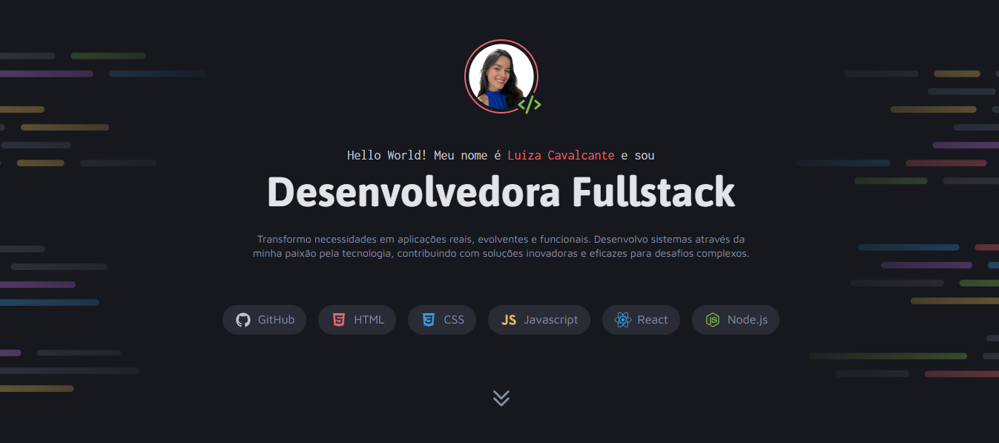
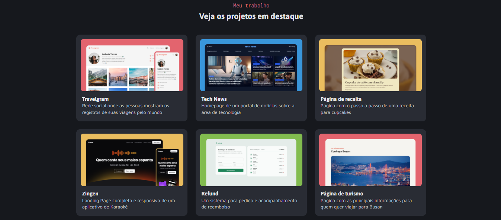

# 📌 Portfólio Dev

**Portfólio Profissional em HTML/CSS**  
Um site estático moderno que exibe meus principais projetos de desenvolvimento, criado para:  
- Apresentar minha identidade como desenvolvedora  
- Demonstrar habilidades em **HTML semântico** e **CSS flexbox/grid**  
- Servir como vitrine para recrutadores e clientes  

## 🛠️ Tecnologias  

## 📸 Preview  

## 🌐 Acesso  
[Clique aqui para acessar o projeto](https://luizacavalcantee.github.io/portfolio-dev/)

Meus outros projetos estão disponíveis em: [github.com/luizacavalcantee](https://github.com/luizacavalcantee)  

💌 **Contato**: cavalcanteluiza13@gmail.com | [LinkedIn](https://www.linkedin.com/in/luizacavalcanteee/)  
